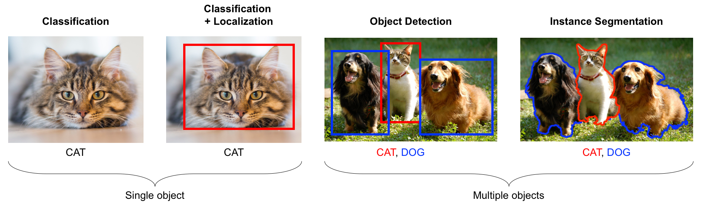
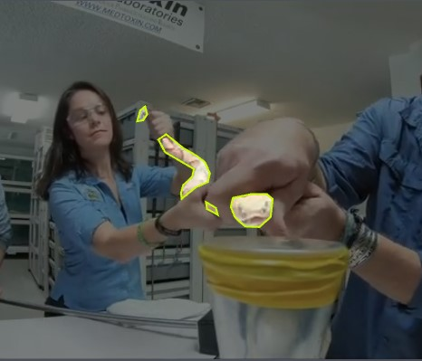
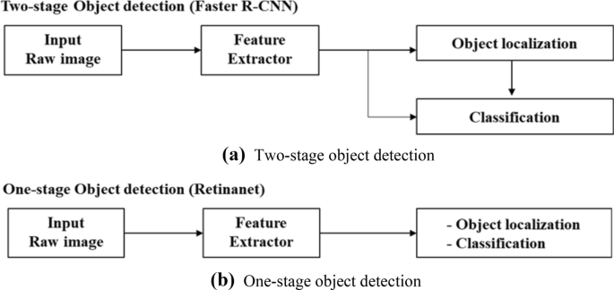
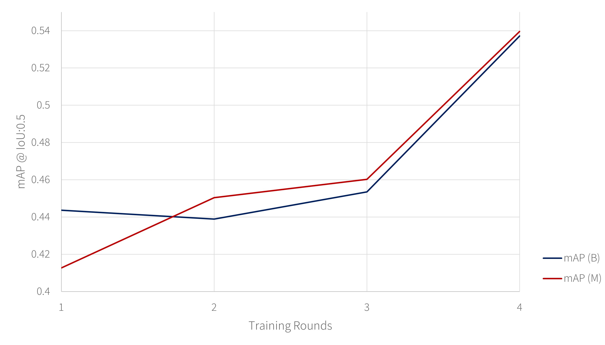
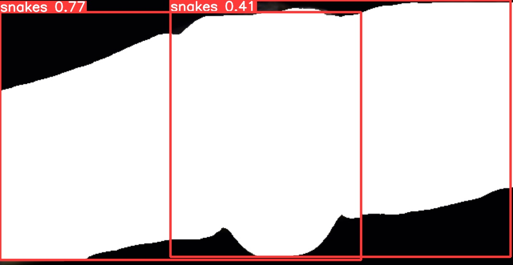
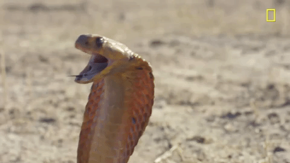
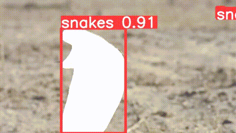
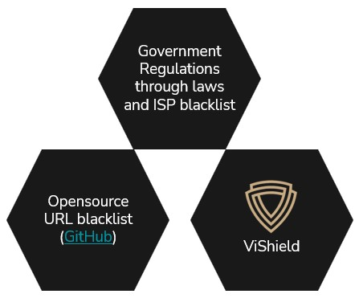

# Computer Vision
#### Deep Learning application of MobileNetv2 for Image Classification
#### Deep Learning application of Yolov7 for Instance Segmentation
---
### Er Jie Yong
https://www.linkedin.com/in/erjieyong

#### Industry Mentors:
Shilpa Sindhe: 
https://www.linkedin.com/in/shilpa-sindhe  
https://shilpa-leo.medium.com/  

---
# Introduction

## Background
In the current day and age where we are bombarded with thousands of digital text, images and videos daily, we are bound to come across text, images or videos that we do not want or should not see. It could be due to multiple reasons such as: 
- Phobia of certain images / videos (snakes, spiders etc.)
- Depression / Anxiety from certain thought provoking texts
- Protection of underage children from pornography
- Violent or Terrorism text, images, videos

In turn, under constant influence of such texts, images and/or videos, a person may experience the following [short term effect](https://www.nhs.uk/mental-health/conditions/phobias/symptoms/#:~:text=Phobias%20can%20limit%20your%20daily,causes%20them%20fear%20and%20anxiety.)
- Sweating / Chills
- Shortness of breath
- Nausea / Headaches / Numbness
- Confusion or disorientation
- Loss of appetite

For some, this might even result in long term detrimental health and societal problems such as
- Axiety / Panic Attacks
- Suicidal thoughts
- Character and Values change

## Problem Statement
However, the internet being a free and diverse ecosystem, is hard to control and police. There are a magnitude of programs, applications or even government agencies out there that are trying to block out undesirable websites by their url only. But there could be millions of such sites on the internet and attempting to create a log of all such websites is akin to a never ending game of whack-a-mole. 

Therefore, in this project, we will attempt to utilise the capabilities of computer vision algorithims together with neural network to identify and localised specific classes of images/videos and filter them out. 

## Scope
This project only serve to demonstrate the capabilities of computer vision. Hence, we will only focus the scope on the following classes. 
  - dogs (testing purpose in case of phobia trigger)
  - cats (testing purpose in case of phobia trigger)
  - snakes
  - trypophobic images

In addition, there are two parts to this project: Image Classification and Instance Segmentation. A good explanation of the difference can be summarised in the following picture:

  
<i>Figure 1: Comparison between image classification, localisation, object detection and instance Segmentation</i>

Our outcome would consists of 2 products:

#### Chrome Extension

This extension should work on chromium based browsers such as Chrome and Edge. The purpose is to filter out images that matches our target classes in real time when a user is browsing the web. Hence, we need to prioritise speed and inference accuracy. Image classification would be used here as the outcome is to be able to change the displayed image entirely, should it match our target class

#### Streamlit App

The purpose of the hosted app is for more post-processing usage. The use case here is when user need to perform post processing of already captured images or videos to filter out the target class. Hence, we will prioritise accuracy as time is of less importance. Streamlit app will only work for snakes currently.

#### Note

The same techniques and algorithims can be applied and trained on other dataset to expand the filtering criteria beyond the current scope. Similar techniques can also be applied to self driving technology as well.

## Success Factor
- Image Classfication
  - Accuracy of multilabel image classification model on validation images above 70%
  - Functioning chrome extension for websites using the standard web framework including asynchronous loading

- Instance Segmentation
  - Mean Average Precision for Bounding Box at 0.5 IoU of Instance Segmentation model on validation images above 50% (considering YOLOv7 published result of 51%)
  - Mean Average Precision for Mask at 0.5 IoU of Instance Segmentation model on validation images above 50% (considering YOLOv7 published result of 64%)
  - Functioning Streamlit application that allow users to submit image / video url for segmentation

## Dataset
Dataset was retrieved from the following sources
- Dogs and cats: [https://storage.googleapis.com/mledu-datasets/cats_and_dogs_filtered.zip](https://storage.googleapis.com/mledu-datasets/cats_and_dogs_filtered.zip)
- Snakes: [https://www.kaggle.com/datasets/goelyash/165-different-snakes-species/download?datasetVersionNumber=9](https://www.kaggle.com/datasets/goelyash/165-different-snakes-species/download?datasetVersionNumber=9)
- Trypophobia: [https://www.kaggle.com/datasets/cytadela8/trypophobia/download?datasetVersionNumber=1](https://www.kaggle.com/datasets/cytadela8/trypophobia/download?datasetVersionNumber=1)
- Snake video: https://www.youtube.com/watch?v=oW4wbbO71iI&t=1s&ab_channel=BraveWilderness

---
# Part 1: Image Classification / Chrome Extension
## Business requirements
- Final model output has to be saved in javascript format so that the extension can be used serverless in order for the extension to be used beyond this project (ie. not served from other paid hosted servers such as google or amazon)
- Speed is important so that the inference result can be fast in order to change the image as fast as possible (can be developed further to route all images to extension first before showing)
- Can afford to be slightly more cpu intensive as the extension is only meant to be used on desktop / laptop and not mobile
- For better accuracy and lesser parameters during transfer learning, prefer pre-trained model that has been trained on a few of the target classes

## Selected Model
#### Javascript requirement

MobileNetv2 is selected in the end because it can be trained in python and subsequently saved in tensorflowjs format. While there are other models out there that are based on pytorch (also supported using torchjs), we chose tensorflow based model as it has a much larger support community which would help us during development(search result count: torchjs: 1,360 results, tensorflowjs: 3,170,000 results)

#### Speed

We need a model that is fast yet still provide relatively high accuracy. Based on tests as shown below, Mobilenet v2 is the fastest.

  
<i>Figure 2: MobileNetv2 has the fastest inference time. [source](https://towardsdatascience.com/bye-bye-mobilenet-hello-efficientnet-9b8ec2cc1a9c)</i>

This speed can also be inferred from [paperswithcode](https://paperswithcode.com/sota/image-classification-on-imagenet) given their relatively much lower number of params as compared to the other newer models.

#### Trained dataset
[MobileNetv2](https://keras.io/api/applications/mobilenet/) is pretrained on ImageNet data which includes dogs, cats and snakes . This would help to provide a good base weight for our transfer learning.

## Data Preparation
Downloaded images are filed into its respective folders of 
- Dogs
- Cats
- Snakes
- Trypo
- Others

As the `Others` folder was originally provided with the trypo dataset, it contained some dogs, cats and snakes images as well. Hence, time was spent to manually remove the dogs, cats and snakes images from the `Others` folder. 

## Transfer Learning
While neural networks has tons of hyperparameters that we can tune, there are some major decisions that have to be made for transfer learning.

#### Pretrained Weights

Given that MobileNetv2 is pretrained with ImageNet that include dogs, cats and snakes, we will keep the pre-trained weight.

#### Unbalance Class

As our dataset consists of unbalanced number of pictures for each class, we passed in weights for each class to prompt the model to "pay more attention" to pictures from the under represented class. [source](https://www.tensorflow.org/tutorials/structured_data/imbalanced_data#calculate_class_weights)

#### Loss Function

The loss function determines how our far off our result is from the ground truth. We will be using categorical crossentropy for MobileNetv2. Optimisation of loss function is done using Adam algorithm

#### Activation Function

Activation function helps us to 'bend the curve of our best fit line'. For the hidden layers, we will use RELU. For our output layer, we will use softmax as we have a multicategorical output

#### Regularisation

Various regularisation techniques are used to prevent overfitting of our model. Dropout and early stopping are used and will formed part of our final model output metric comparison.

## Metric
Hidden Layers | Regularisation | Validation Loss | Validation Accuracy | 
-------- | ---------- | -------- | -------- |
1 | None | 0.1402 | 0.9586
1 | EarlyStopping | 0.1570 | 0.9603
2 | EarlyStopping, Dropout | 0.1533 | 0.9522

## Chrome Extension Architecture
The extension consists of 8 main parts
- [filter_multi.ipynb](./Image_Classification_Extension/src/filter_multi.ipynb): Python notebook used for perform transfer learning and training the final model.
- [package.json](./Image_Classification_Extension/package.json): List out the command for yarn to run when building the javascript package, as well as the required dependencies. Yarn will automatically compile and combine all the necessary dependencies required to run .js files.
- [background.js](./Image_Classification_Extension/src/background.js): A script that runs in the background responsible for processing the image, calling the model and pushing the model results back to contentScript.js.
- [contentScript.js](./Image_Classification_Extension/src/contentScript.js): A script that runs in the front end that is able to see what is displayed on the web page and interact with it. Responsible for searching for images on the web page, passing it to background.js and then changing the image based on the output that background.js returns.
- [manifest.json](./Image_Classification_Extension/dist/manifest.json): JSON file listing out the extension's descriptions, version, requirements, permissions, files url
- [popup.css](./Image_Classification_Extension/dist/popup.css): Control the style of the extension pop up
- [popup.html](./Image_Classification_Extension/dist/popup.html): Basic html structure of the extension pop up 
- [popup.js](./Image_Classification_Extension/dist/popup.js): Responsible for reacting to the changes that user made on the popup such as saving the filter binary value (T/F) to local chrome storage 

  
<i>Figure 3: Overview of model and extension architecture</i>

## Installation Instruction
1) Download the whole `Image_Classification_Extension` folder
2) Made sure that you have nodejs and yarn installed on your local system
3) In Command Line Interface, navigate to `Image_Classification_Extension` folder
4) Run `yarn build` in command line interface 
5) Enable developer mode in your chrome browser at chrome://extensions.
6) Click "Load unpacked" and point to `Image_Classification_Extension/dist` folder
7) Choose your desired filter on the extension popup
8) Load any website and browse as per normal

## Outcome
  
<i>Figure 4: Showcase of chrome extension filtering out dog class</i>

## Limitations of model / extension
- Only work for images larger than 128 by 128 pixel
- Accuracy is low for images below 224 by 224 pixel due to MobileNetv2 architecture which require that as minimum size. Hence pictures below that 224 pixel would have less information to pass through the model. 
- Only able to detect 1 class per picture. Would need to train for multi output
- Allow for object detection first before image classification. This could potentially improve accuracy of classification

---
# Part 2: Instance Segmentation / Streamlit App
## Business requirements
- Although this is to be used as a means of post processing images/videos, we need to thread a fine balance between speed and accuracy. It must be of good accuracy yet of reasonable speed so that we do not use up too much resources
- To reduce burden on the computing resource and time constraint of project, the output model should preferably work on both images and videos
- For better accuracy and lesser parameters during transfer learning, prefer pre-trained model that has been trained on a few of the target classes
- To establish a feedback loop given the relatively low metrics (Mask AP) even for state of the art models currently

## Selected Model
#### Speed vs Accuracy
There's 3 main categories of research shared on [paperswithcode] relating to instance segmentation
- [Real-time Instance Segmentation](https://paperswithcode.com/task/real-time-instance-segmentation)
- [Video Instance Segmentation](https://paperswithcode.com/task/video-instance-segmentation)
- [Real-Time Object Detection](https://paperswithcode.com/task/real-time-object-detection)

An exploration of these pages would reveal that there are certain duplicate property among them.
- Speed: All 3 categories are looking at real time detection of segments. In particular, the best performing model in real time object detection, YOLOv7 also allow for instance segementation.
- Accuracy: Papers on video instance segmentation shows considerably better mask AP result as compared to real time instance segmentation category. This could be due to its similarity in nature and more papers are published on Video Instance Segmentation instead.

Categories | Model | FPS | Mask AP |
-------- | ---------- | -------- | -------- |
[Real-time Instance Segmentation](https://paperswithcode.com/task/real-time-instance-segmentation) | SparseInst-608 | 40 | 37.9 |
[Video Instance Segmentation](https://paperswithcode.com/task/video-instance-segmentation) | IDOL | 17.6 | 64.3 |
[Real-Time Object Detection](https://paperswithcode.com/task/real-time-object-detection) | YOLOv7-E6E | 36 | [64.0](https://github.com/WongKinYiu/yolov7/tree/u7/seg) | 

Among the 3 models, Yolov7 provides the best balance between speed (FPS) and accuracy (Mask AP).

#### Flexibility to work on Images / Videos
While IDOL provides better masking result, we have an added constraint here which is that it should work on both images and videos using the same model to avoid training different model twice. Given that Yolov7 is much more well documented and allows for video instance segmentation as well, we would ultimately choose YOLOv7 for this project. Nonetheless, video instance segmentation would definitely be looked into outside of this project constraints

#### Pretrained Weights
As there's time constraint in this project, we will only be focusing on instance segmentation with snakes. However, there's no dataset currently over the internet that has annotated mask coordinates of snakes. As such, there's no models that are pre-trained on snakes as well.

## Data Preparation
In line with our last business requirement to allow for a feedback loop, we decided to proceed with Roboflow to assist with data preparation. [Roboflow](https://roboflow.com/) is a website that allows users to perform annotation on the cloud while also providing api access to interact with our dataset. This API would provide an avenue for us to perform active learning.

Data is prepared by first using a subset of 245 images from the snake video as well as 100 images from our snake image dataset used previously for image classification. We have to mark out the snake's position in each images in the most accurate polygon shape so that this can be used for our model training later.

Mask annotation was made manually via Roboflow's platform several times due to active learning. This would be discussed further under the metric section. 
  
<i>Figure 5: Example of mask segmentation annotation. Green border denotes polygon coordinates</i>

An example of the accompanying label (Yolov7 format) for figure 5 would be as follows. For each row, the first number (0) denotes the class. For our project, as there's only 1 snake class, it will always be 0. The rest of the numbers per row shows the coordinates of each polygon on the picture.

`0 0.459375 0.577777778125 0.44375 0.5611111109375 0.4453125 0.58055555625 0.4625 0.597222221875 0.459375 0.577777778125
0 0.3453125 0.3333333328125 0.3515625 0.3166666671875 0.3484375 0.29444444375 0.340625 0.30555555624999997 0.3359375 0.3361111109375 0.3453125 0.3333333328125
0 0.48887583125 0.601851853125 0.493214325 0.6111111109375 0.5053621078125 0.62962963125 0.527922275 0.6311728390625 0.5453125 0.602777778125 0.5484375 0.5527777781250001 0.5390625 0.5388888890625 0.515625 0.5388888890625 0.4859375 0.55 0.4828125 0.575 0.48887583125 0.601851853125
0 0.425 0.46944444374999994 0.42206302500000004 0.49074074218749997 0.40817984531249996 0.5138888890625 0.40470905 0.535493828125 0.4055767484375 0.5524691359375 0.4281369171875 0.520061728125 0.446875 0.50555555625 0.45 0.48055555625 0.4421875 0.45 0.429004615625 0.43209876718749995 0.40817984531249996 0.410493828125 0.38125 0.372222221875 0.3691334 0.387345678125 0.3796875 0.42222222187499997 0.425 0.46944444374999994`

## Transfer Learning
Due to our constraints, we settled on using Yolov7 for its speed, accuracy and flexibility to train on both images and videos. 

One of the reason why Yolov7 is so popular and fast is due to it being a one stage object detection which simulataneously output both the bounding box coordinate as well as the class of the object within the box. This is as opposed to 2 stage object detection where the model will first perform object detection, before performing classification on the detected region.

  
<i>Figure 6: Graphical representation of 1 stage vs 2 stage object detection</i>

#### Pretrained Weights

Although Yolov7 is pretrained on the [COCO](https://cocodataset.org/#home) dataset which does not include snakes, we will be using it's pretrained weights to speed up our model training. We will be using the [Yolov7-seg.pt](https://github.com/WongKinYiu/yolov7/releases/download/v0.1/yolov7-seg.pt) weights.

#### Hyperparameters

We will only change the following hyperparameters and leave the rest intact
- Custom training dataset location
- Number of classes
- Class name
- Mask color to (255, 255, 255) so that it is all white
- Mask alpha so that it is opague
- save_dir to replace previous prediction instead of incremental new folder
- change video output to vp90 codec with .webm format instead of mp4v codec with .mp4 format in order to be played in html5 video player

## Metric

Round | No of Training Images* | No of Validation Images | Weights |  mAP_0.5 (B) | mAP_0.5 (M) | Precision | No of Testing Images | No of Testing Images send for annotate below 70% confidence |
-------- | -------- | ---------- | -------- | -------- | -------- | -------- | -------- | -------- |
1 | 543 | 55 | Yolov7 weight | 0.4436 | 0.4127 | 0.7289 | 1000 | 100 |
2 | 843 | 55 | Yolov7 weight | 0.4389 | 0.4504 | 0.7891 | 1000 | 100 |
3 | 1196 | 55 | weight from R2 | 0.4535 | 0.4602 | 0.7558 | 1000 | 100 |
4 | 1413 | 75 | weight from R3 | 0.5372 | 0.5396 | 0.8639 | 1000 | 100 |

* Include image augmentation such as flipping of image, zooming, grayscale and noise

  
<i>Figure 7: mAP is on increasing trend with more images fed into training loop</i>

## MLOps & Streamlit Architecture 
- [yolov7-seg-snake-images_colab.ipynb](./Instance_Segmentation_Streamlit/yolov7-seg-snake-images_colab.ipynb) : Model training notebook that is trained on google colab 
- [Instance_Segmentation_Deployment.ipynb](./Instance_Segmentation_Streamlit/Instance_Segmentation_Deployment.ipynb) : Deployment notebook to output docker and flask script for uploading to google cloud and streamlit

#### Active learning is engaged to continuously push low confidence image output back to roboflow. 
  
<i>Figure 8: Overview of model and streamlit architecture. Red arrows denote complete MLOps loop</i>

## Outcome

Our streamlit app can be found at: https://erjieyong-v-instance-segmentation-streamlitstreamlit-app-2r2fpv.streamlit.app/

#### Examples of segmented photos
 
<i>Figure 9: Image of snake before and after segmentation</i>

#### Example of segmented video / gif
 
<i>Figure 10: Snake gif before and after segmentation</i>

## Limitation of model / app
- The mAP for both the bounding box and mask is low mainly due to low number of training data. Generally CNN requires much more dataset than the 1 to 2 thousand images that we have provided here. The complexity for the model is further complicated by taking into account the following:
    - The are more than [3000](https://www.nationalgeographic.com/animals/reptiles/facts/snakes-1#:~:text=There%20are%20more%20than%203%2C000,or%20significantly%20wound%20a%20human.) species of snakes in the world that come in different color, texture and shapes (eg. coiled, elongated). Therefore there are less defining features for snakes if we are just identifying snakes in general
    - Snakes living in different habitats that tends to cuts off the snake's body in picture such as grass or water.
    - Snakes living in habitats that blend in with the snakes body such as in the dessert
    - different camera angles that focus only on certain portion of the snake (eg. head, or body only)
    Therefore active learning is extremely important in order to constantly improve our base model.
- Processing of images and videos is slow due to no gpu and no saved instance being activated on google cloud run. 
- Yolov7 performs instance segmentation on a frame to frame basis independently with no relation to the previous and next frame. Therefore, in a video context, the performance should be lower than models such as IDOL which tracks objects between frames.

---
# Conclusion
We manage to successfully train our model and deploy both a chrome extension and streamlit app that can help users to filter out our target classes. 

On evaluating our metrices, our image classification model is performing very well with accuracy score of over 95%. However, due to the small dataset for instance segmentation of snakes, our instange segmentation model isn't performing very well with mean average precision (0.5) of masks at 0.5396. Nonetheless, we are seeing a continuous upward trend in our result through active learning and would expect the result to continue climbing.  

In summary, evaluation of our success factors set at the start of the project would be as follows:

Tasks | Factors | Outcomes |
-------- | -------- | ---------- |
Image Classification | Validation Image Accuracy | 0.9586
Image Classification | Functioning Chrome Extension | Yes
Instance Segmentation | mAP_0.5(B) | 0.5372
Instance Segmentation | mAP_0.5(M) | 0.5396
Instance Segmentation | Functioning Streamlit App | Yes

# Recommendation
For the purpose of filtering out images, videos or even text, it is prudent to always rely on multiple gateways and take a multi prong approach in order for the results to be reliable and effective.

Especially for websites that consists of violence, terrorism and pornography, an approach consisting of government regulations, open-source url filters and ViShield is recommended to continuously and effectively keep out the unwanted images, videos and text.

  
<i>Figure 11: 3 prong approach to manage unwanted sites and image</i>

# Future Steps
- Continue to improve on the instance segmentation model 
- Explore more models such as IDOL that specialise in video instance segmentation
- Expand filter classes beyond dogs, cats, snakes, tropophobia images
- Expand feature to allow instance segmentation on real time videos such as youtube or video streaming
- Allow real time streaming of output logs from model hosted on google cloud to streamlit